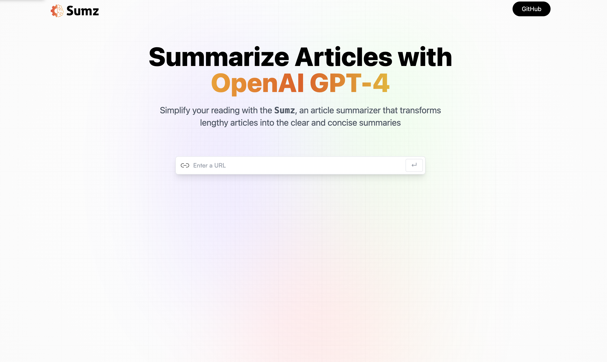
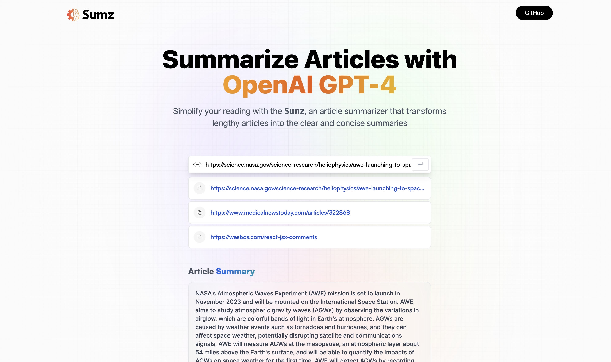

## Sumz - Open Source Article Summarizer with OpenAI GPT-4
Sumz is an open-source article summarization tool powered by the advanced capabilities of OpenAI GPT-4. Designed to help users quickly grasp the essence of lengthy articles, Sumz transforms verbose content into clear, concise, and informative summaries. By leveraging the cutting-edge natural language processing techniques of GPT-4, Sumz ensures that generated summaries maintain context, coherence, and accuracy.

## Key Features
- Modern UI/UX: Provides a sleek and user-friendly interface for easy navigation and readability
- Save User Search History: Allows users to save their search history, making it convenient to revisit previously summarized articles.
- Error Handling: Robust error handling if the invalid link is entered to ensure a smooth user experience.

## Technologies Used
ReactJS: A popular JavaScript library for building user interfaces.
Tailwind CSS: A utility-first CSS framework for designing modern, responsive web applications.
OpenAI API: Leveraging the power of OpenAI for accurate and coherent article summarization.
Vite: A fast and minimalist build tool for modern web development.
RTK Query: Redux Toolkit Query for efficient data fetching and state management.
Redux Toolkit: A set of tools that simplifies the process of managing state in React applications.

